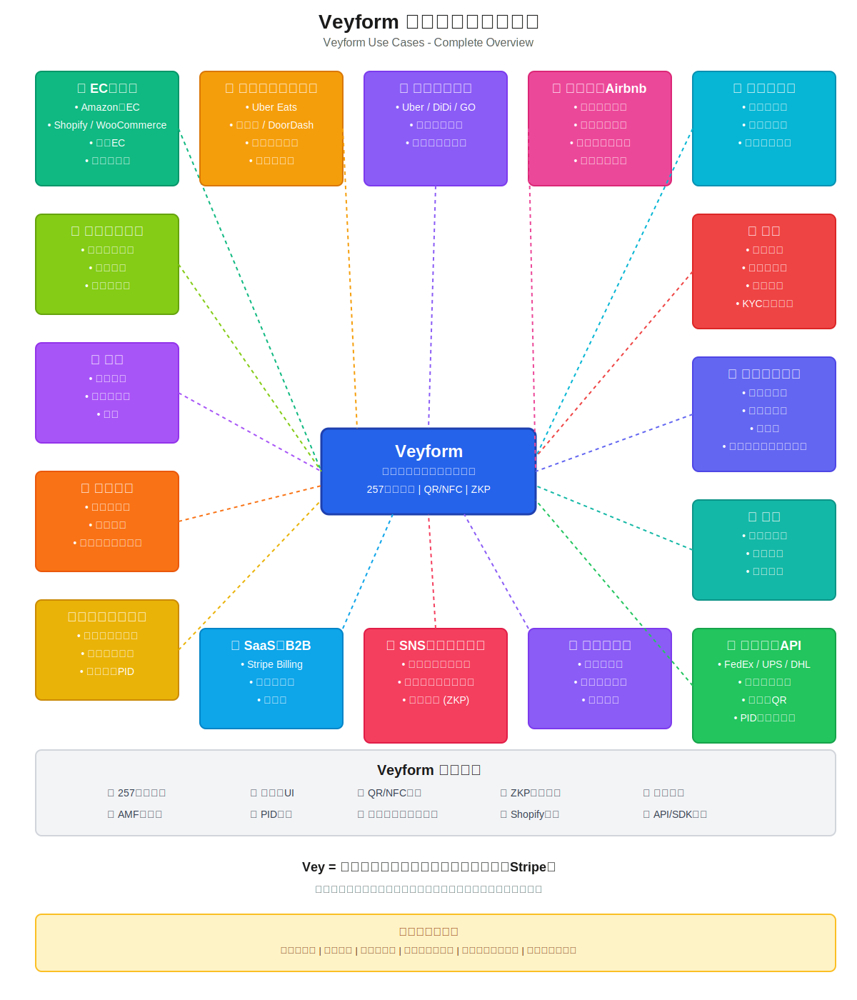

# Veyform 住所入力代行 ― ユースケース & 導入領域 総まとめ（完全版）

Veyform QR・NFC住所ID は、
**「住所入力が発生するすべての場面」** で利用できる世界標準フォームです。

ECに限らず、
生活・行政・配送・旅行・金融・不動産・教育・医療まで、
住所が関わるあらゆるプロセスを自動化・正規化できる唯一のプラットフォーム。

---

## 目次 / Table of Contents

- [1. 住所入力代行が使える主要ユースケース一覧](#1-住所入力代行が使える主要ユースケース一覧)
- [2. Veyform を導入できるサイトジャンル（カテゴリ別）](#2-veyform-を導入できるサイトジャンルカテゴリ別)
- [3. Veyform の強み（住所入力代行の本質価値）](#3-veyform-の強み住所入力代行の本質価値)
- [4. 引っ越し領域での効果](#4-引っ越し領域での効果)
- [5. ホテル予約領域での効果](#5-ホテル予約領域での効果)
- [6. 共通して言えること（全業界共通の価値）](#6-共通して言えること引っ越し--ホテル--全業界)
- [7. 最終まとめ](#7-最終まとめ)

---

## ユースケース全体図 / Use Cases Overview

**図解：** Veyformが活用される15の主要領域と、中心にあるVeyformエコシステムの関係性を示しています。各領域からVeyformへの接続は、住所入力が発生するあらゆる場面でVeyformが統一的なソリューションを提供できることを表現しています。

---

## 1. 住所入力代行が使える主要ユースケース一覧

### ① ECサイトの配送先入力（王道）

**対象サービス:**
- Amazon型EC
- Shopify / WooCommerce
- すべての越境EC
- ギフト配送の住所共有（QR/リンクで相手に地点入力）

**効果:**
- ★ 離脱率の大幅低下
- ★ 現地語＋英語表記の同時生成

---

### ② フードデリバリー・配達サービス

**対象サービス:**
- Uber Eats / 出前館 / DoorDash
- 生鮮食品配送・定期便
- ピザ・寿司などの宅配
- 置き配指示

**効果:**
- ★ 緯度経度自動補完で誤配減少

---

### ③ タクシー配車・ライドシェア

**対象サービス:**
- Uber / DiDi / GO
- 空港送迎予約
- ホテル → 空港シャトル

**効果:**
- ★ QRでホテル住所をそのまま渡せる
- ★ 観光客でも迷わない

---

### ④ ホテル・Airbnb チェックイン

**対象サービス:**
- 宿泊者カード
- 住所証明
- 海外ゲストのローマ字表記
- 旅館業法に必要な住所項目の自動生成

**効果:**
- ★ フロントでQR/NFCを読み取れば住所記入が不要
- ★ インバウンドで圧倒的に役立つ

---

### ⑤ 家具・家電の設置工事サービス

**対象サービス:**
- 洗濯機
- 冷蔵庫
- エアコン

**効果:**
- ★ 表記ゆらぎの住所が多い領域を標準化
- ★ 現地語住所も英語に自動変換

---

### ⑥ コワーキング・シェアオフィス契約

**対象サービス:**
- 登記住所
- 郵便転送先
- 契約書住所

**効果:**
- ★ VeyaddressID で書類作成の手間が激減

---

### ⑦ 金融サービス（銀行・証券・カード）

**対象サービス:**
- 新規口座開設
- クレジットカード申請
- 住所変更
- KYC（本人確認）

**効果:**
- ★ 現地語＋英語＋ローマ字を自動生成
- ★ 世界的に求められる住所正規化を満たす

---

### ⑧ 行政サービス（デジタル庁系）

**対象サービス:**
- 各種届け出
- 住民票の住所一致確認
- 税申告
- 引っ越しワンストップ

**効果:**
- ★ 国家レベル採用の可能性がある領域

---

### ⑨ 医療 / クリニック予約

**対象サービス:**
- 初診問診票
- 保険情報
- 薬局配送

**効果:**
- ★ 高齢者でもQRから自動入力可能

---

### ⑩ 学校 / 大学フォーム

**対象サービス:**
- 出願
- 留学生住所登録
- 寮届

**効果:**
- ★ 国際住所を自動整形
- ★ ローマ字も生成

---

### ⑪ イベント / チケット販売

**対象サービス:**
- コンサート
- セミナー
- スポーツイベント

**効果:**
- ★ 顧客住所管理の手間が消える

---

### ⑫ SaaS / B2B アプリの請求先住所

**対象サービス:**
- Stripe Billing
- Notion / ClickUp
- 契約書（VeyLegal連携）

**効果:**
- ★ 企業の複雑な住所構造を正規化

---

### ⑬ SNS / マッチングアプリ

**対象サービス:**
- シェアハウス応募
- オフ会チェックイン
- 匿名配送（ZKP）

**効果:**
- ★ 住所を公開せずに発送だけ許可可能

---

### ⑭ アート / クリエイター通販（Apollas連携）

**対象サービス:**
- グッズ販売
- 展示会招待状
- ファンへの海外配送

**効果:**
- ★ 越境販売を容易にする住所変換

---

### ⑮ 物流業者向け（プロAPI）

**対象サービス:**
- FedEx / UPS / DHL / 日本郵便 / ヤマト / 佐川
- 配達員アプリ
- 不在票QR

**効果:**
- ★ PID（住所ID）により誤配を大幅削減

---

## 2. Veyform を導入できるサイトジャンル（カテゴリ別）

### EC / コマース
Shopify、WooCommerce、WordPress、Magento、BASE、STORES、独自EC

### デリバリー / 配達業
Uber Eats、DoorDash、出前館、配送アプリ

### 観光・予約サービス
Booking.com、Airbnb、Expedia、JAL/JR、高速バス

### 金融・保険サービス
地銀、ネット銀行、証券、保険、カード会社

### 行政・公共システム
マイナポータル、市役所オンライン窓口、税務署、健康保険

### 物流 / WMS / 倉庫
物流基幹システム、配送API、WMS、ラストワンマイルアプリ

### 教育・アカデミック
大学出願、奨学金、留学生管理

### 医療
診療予約、初診票、保険請求

### 不動産
契約書住所、内見アプリ、賃貸管理

### SNS / マッチング / コミュニティ
匿名配送、ギフト配送、住所非公開の受け取り

### 法人向け SaaS
契約書、請求書、CRM、社員管理

---

## 3. Veyform の強み（住所入力代行の本質価値）

✔ **世界257カ国の住所形式に完全対応**（YAMLで管理）  
✔ **多言語表示**（現地語・英語・ローマ字）  
✔ **QR・NFCで1秒入力**  
✔ **ゼロ知識証明（ZKP）**で住所を明かさず配送可能  
✔ **自動補完**（郵便番号、地図ピン、建物名サジェスト）  
✔ **Shopify / WooCommerce に数秒で導入可能**  
✔ **ブラウザの自動補完より圧倒的に正確**

= 世界中のサイトに埋め込める、住所入力の**"唯一の標準フォーム"**

---

## 4. 引っ越し領域での効果

| 用途 | 効果 |
|------|------|
| **見積りフォーム** | 正確な現住所と新住所 |
| **面倒な住所変更** | Veyaccountからワンクリック同期 |
| **荷物配送** | PID（住所ID）で誤配防止 |
| **契約書の住所** | 自動整形で書類の統一 |

**引っ越し産業との相性は最強。**

---

## 5. ホテル予約領域での効果

| 課題 | Veyformの解決策 |
|------|----------------|
| **国によって住所体系が違う** | Veyformで自動切替 |
| **外国人のローマ字住所** | 自動生成 |
| **チェックインカード** | QRで一瞬 |
| **荷物の前日配送** | PIDで紐づけミスゼロ |

**インバウンド市場で即価値。**

---

## 6. 共通して言えること（引っ越し × ホテル × 全業界）

| よくある問題 | Veyformが解決 |
|-------------|--------------|
| 住所が複雑 | 国別YAMLが自動切替 |
| 現地語→英語が難しい | 自動変換 |
| 表記ゆらぎ（丁目/番地など） | 正規化（AMF） |
| ミスが重大トラブルになる | バリデーションで防止 |
| 外国人が書けない | 多言語UI |
| 手書きが必要 | QR/NFCで代行入力 |

→ **Vey は「住所を正しく伝える世界標準インフラ」になる。**

---

## 7. 最終まとめ

### Veyform が強く刺さる領域

1. **EC・配送**
2. **引っ越し**
3. **ホテル・旅行**
4. **金融・行政**
5. **教育・医療**
6. **物流・倉庫**
7. **オフィス契約**
8. **マッチング・コミュニティ**
9. **SaaS・B2Bアプリ**

= **住所を入力するすべての体験を1つの標準に統合できる。**

---

### Vey が実現する世界

✨ **住所入力が消える**  
✨ **配送ミスが消える**  
✨ **多言語住所が自動生成される**  
✨ **国際的に住所がつながる**  
✨ **住所IDで匿名配送まで可能**

---

### Vey = 世界住所の新しいプロトコル（住所のStripe）

Veyformは単なる「フォーム」ではなく、
**世界中の住所を正規化・接続し、あらゆるサービスで再利用可能にする**
新しい住所プロトコルです。

---

## 関連ドキュメント / Related Documentation

- [Veyform README](./README.md) - Veyformの概要
- [Veyform Features](./FEATURES.md) - 機能詳細
- [Veyform Quick Start](./QUICK_START.md) - クイックスタートガイド
- [Veyvault Integration](../Veyvault/README.md) - Veyvault連携
- [VeyExpress](../VeyExpress/README.md) - 配送統合プラットフォーム
- [Vey Ecosystem](../../README.md) - Veyエコシステム全体

---

**最終更新日 / Last Updated:** 2025-12-05
