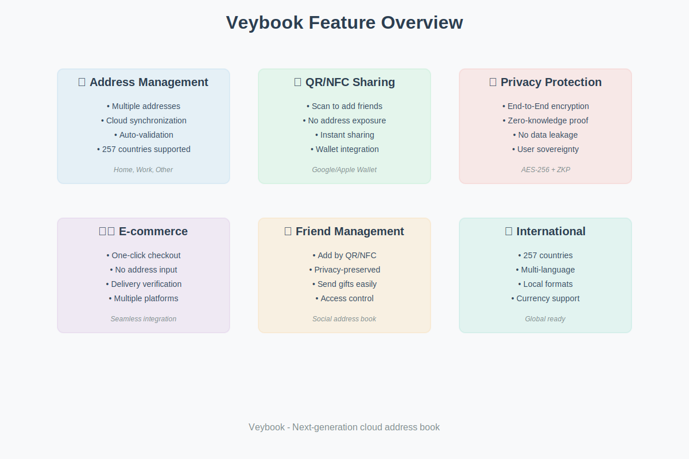
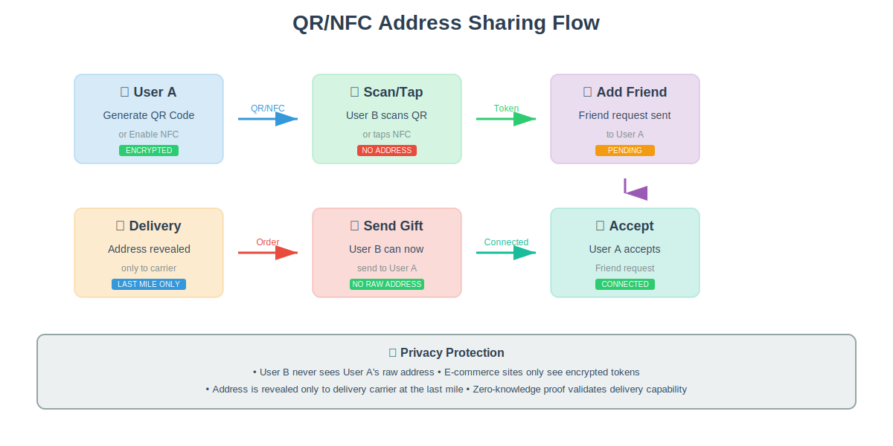
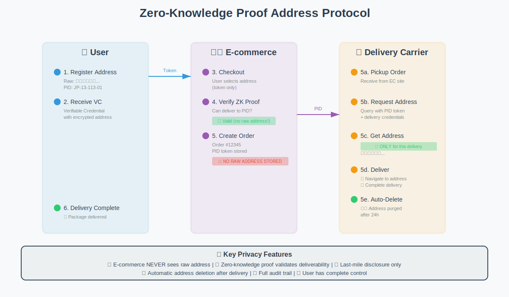

# 📸 スクリーンショット・機能詳細 / Screenshots & Feature Details

このドキュメントでは、Veyエコシステムの主要機能を視覚的に説明します。

This document provides visual explanations of the key features in the Vey ecosystem.

---

## 目次 / Table of Contents

1. [機能概要](#機能概要--feature-overview)
2. [QR/NFC共有フロー](#qrnfc共有フロー--qrnfc-sharing-flow)
3. [ゼロ知識証明プロトコル](#ゼロ知識証明プロトコル--zero-knowledge-proof-protocol)
4. [ミニプログラムUI](#ミニプログラムui--mini-program-ui)
5. [システムアーキテクチャ](#システムアーキテクチャ--system-architecture)

---

## 機能概要 / Feature Overview



### 📝 Address Management (住所管理)

**複数の住所をクラウドで一元管理**

- 🏠 自宅、職場、実家など複数の住所を登録
- ☁️ クラウド同期で全デバイスからアクセス
- ✅ 自動バリデーションで入力ミスを防止
- 🌍 257カ国の住所形式に対応

**特徴:**
- AMF (Address Meta Format) による標準化
- リアルタイムバリデーション
- 住所の自動正規化
- PID (Place ID) 自動生成

---

### 📱 QR/NFC Sharing (QR/NFC共有)

**スキャンするだけで友達追加**

- 📲 QRコードまたはNFCで即座に共有
- 🔒 生住所を見せずにシェア
- ⚡ ワンタップで友達登録完了
- 💳 Google Wallet / Apple Wallet 統合

**特徴:**
- 暗号化されたトークンのみ共有
- プライバシー保護された友達追加
- デジタルウォレット対応
- オフラインでもスキャン可能

---

### 🔐 Privacy Protection (プライバシー保護)

**エンドツーエンド暗号化とゼロ知識証明**

- 🔐 AES-256 エンドツーエンド暗号化
- 🛡️ ゼロ知識証明 (ZKP) プロトコル
- 🚫 第三者にデータ漏洩なし
- 🔑 ユーザーがデータを完全管理

**特徴:**
- クライアント側で暗号化
- サーバーも生データにアクセス不可
- ZK証明で配送可能性のみ検証
- 完全な監査証跡

---

### 🛍️ E-commerce Integration (EC連携)

**ワンクリックチェックアウト**

- 🛒 住所入力不要のチェックアウト
- 📦 複数のECプラットフォーム対応
- ✅ 配送先を自動検証
- 🚚 配送業者との直接連携

**特徴:**
- シームレスな統合API
- 住所トークンベース
- リアルタイム配送料計算
- 注文追跡機能

---

### 👥 Friend Management (友達管理)

**生住所を見せずに友達管理**

- 🎁 友達にギフトを送れる
- 🔒 プライバシー保護された住所共有
- 👥 ソーシャル住所帳
- 🔐 アクセス権限管理

**特徴:**
- QR/NFCで友達追加
- 生住所は見えない
- 送信権限のみ付与
- いつでも取り消し可能

---

### 🌍 International Support (国際対応)

**グローバル対応**

- 🗺️ 257カ国・地域対応
- 🌐 多言語インターフェース (日本語、英語、中国語、韓国語など)
- 🏪 現地の住所形式に対応
- 💱 複数通貨サポート

**特徴:**
- ローカライズされたUI
- 現地の郵便番号形式
- 住所表示順の自動調整
- タイムゾーン対応

---

## QR/NFC共有フロー / QR/NFC Sharing Flow



### フロー詳細 / Flow Details

#### ステップ1: QRコード生成 / QR Code Generation

**ユーザーA (送信者)**
- アプリでQRコード生成ボタンをタップ
- 住所PIDが暗号化されたQRコードが表示
- またはNFCを有効化

**セキュリティ:**
- QRコードには暗号化されたトークンのみ含む
- 生住所は含まれない
- タイムスタンプ付きで有効期限設定可能

#### ステップ2: スキャン/タップ / Scan/Tap

**ユーザーB (受信者)**
- アプリのQRスキャナーを起動
- ユーザーAのQRコードをスキャン
- またはNFC対応デバイスをタップ

**プライバシー:**
- スキャンしても生住所は表示されない
- トークンのみが交換される

#### ステップ3: 友達追加 / Add Friend

**ユーザーB → ユーザーA**
- 友達リクエストが自動送信
- ユーザーAに通知が届く
- 状態: PENDING

#### ステップ4: 承認 / Accept

**ユーザーA**
- 友達リクエストを確認
- 承認/拒否を選択
- 承認するとユーザーBと接続
- 状態: CONNECTED

#### ステップ5: ギフト送信 / Send Gift

**ユーザーB**
- 接続された友達リストからユーザーAを選択
- ECサイトでギフトを購入
- 配送先としてユーザーAを指定
- **重要**: 生住所は見えない

#### ステップ6: 配送 / Delivery

**配送業者**
- ECサイトから配送依頼を受ける
- VeyAPIに住所PIDトークンで問い合わせ
- 配送時のみ生住所にアクセス
- 配送完了後、自動的に住所は削除 (24時間後)

### プライバシー保護のポイント / Privacy Protection Points

| 段階 | 見える情報 | 見えない情報 |
|------|-----------|-------------|
| QRコード生成 | 暗号化トークン | 生住所 |
| スキャン | ユーザー名、都市名 | 詳細住所 |
| 友達登録 | プロフィール情報 | 住所詳細 |
| ギフト送信 | 配送可能エリア | 正確な住所 |
| 配送 | 配送業者のみアクセス | ECサイトは見えない |

---

## ゼロ知識証明プロトコル / Zero-Knowledge Proof Protocol



### プロトコル詳細 / Protocol Details

#### 1. 住所登録 / Address Registration

**ユーザー → Veyシステム**

```typescript
// 住所の登録と暗号化
const rawAddress = {
  country: 'JP',
  postalCode: '150-0001',
  prefecture: '東京都',
  city: '渋谷区',
  address: '神宮前1-2-3'
};

// PID生成
const pid = encodePID(normalizeAddress(rawAddress));
// 結果: "JP-13-113-01-T01-B02-BN03"

// 暗号化して保存
const encryptedAddress = encrypt(rawAddress, userPublicKey);
await saveAddress(userId, encryptedAddress, pid);
```

#### 2. Verifiable Credential (VC) 発行 / VC Issuance

**Veyシステム → ユーザー**

```typescript
// VCの発行
const vc = createAddressPIDCredential({
  userDID: 'did:key:user123',
  providerDID: 'did:web:vey.example',
  pid: 'JP-13-113-01',
  country: 'JP',
  region: '13',
  validUntil: '2025-12-31'
});
```

**VCに含まれる情報:**
- ユーザーDID
- 住所PID
- 国コード、都道府県コード
- 有効期限
- 発行者の署名

**VCに含まれない情報:**
- 生住所
- 詳細な地番
- 建物名、部屋番号

#### 3. ECサイトでチェックアウト / E-commerce Checkout

**ユーザー → ECサイト**

```typescript
// チェックアウト時
const addressToken = selectAddressFromVeyvault();

// ECサイトに送信されるのはトークンのみ
checkout({
  items: cartItems,
  addressToken: addressToken,  // PIDトークン
  paymentMethod: paymentInfo
});
```

#### 4. ZK証明の検証 / ZK Proof Verification

**ECサイト → Veyシステム**

```typescript
// 配送可能性の検証 (生住所は見ない)
const zkProof = await verifyDeliveryZKP({
  pidToken: addressToken,
  conditions: {
    allowedCountries: ['JP'],
    allowedRegions: ['13', '14', '27'],  // 東京、神奈川、大阪
    shippingMethod: 'standard'
  }
});

if (zkProof.valid) {
  // 配送可能
  createOrder(orderDetails, addressToken);
} else {
  // 配送不可
  showError('このエリアには配送できません');
}
```

**ZK証明の内容:**
- ✅ この住所は配送可能エリア内である
- ✅ 国コード、都道府県コードが条件に一致
- ✅ ユーザーが実際にこの住所を所有している
- ❌ **生住所は含まれない**

#### 5. 配送業者への住所開示 / Address Disclosure to Carrier

**ECサイト → 配送業者**

```typescript
// 配送業者のみがアクセス可能
const deliveryRequest = {
  orderId: 'ORDER-12345',
  pidToken: addressToken,
  carrierCredentials: carrierJWT
};
```

**配送業者 → Veyシステム**

```typescript
// 配送業者が住所を取得
const address = await requestAddressForDelivery({
  pidToken: addressToken,
  orderId: 'ORDER-12345',
  carrierDID: 'did:web:carrier.example',
  carrierAuth: carrierJWT
});

// 取得できる情報
console.log(address);
// {
//   recipient: '山田太郎',
//   postalCode: '150-0001',
//   prefecture: '東京都',
//   city: '渋谷区',
//   address: '神宮前1-2-3',
//   building: 'ABCマンション 101号室',
//   phone: '090-1234-5678'
// }
```

**アクセスログ:**
```typescript
// すべてのアクセスはログに記録
{
  timestamp: '2024-12-04T10:30:00Z',
  accessor: 'did:web:carrier.example',
  orderId: 'ORDER-12345',
  purpose: 'delivery',
  expiresAt: '2024-12-05T10:30:00Z'  // 24時間後に自動削除
}
```

#### 6. 配送完了と自動削除 / Delivery Completion & Auto-deletion

```typescript
// 配送完了
await markDeliveryComplete('ORDER-12345');

// 24時間後に自動実行
setTimeout(async () => {
  await purgeDeliveryAddress('ORDER-12345');
  console.log('住所データを削除しました');
}, 24 * 60 * 60 * 1000);
```

### ZKPプロトコルの利点 / ZKP Protocol Benefits

| ステークホルダー | 利点 |
|---------------|------|
| **ユーザー** | プライバシー完全保護、データ主権 |
| **ECサイト** | 住所管理不要、GDPR準拠が容易 |
| **配送業者** | 必要な時だけアクセス、コンプライアンス対応 |
| **規制当局** | 完全な監査証跡、透明性 |

---

## ミニプログラムUI / Mini-Program UI


### UI設計哲学 / UI Design Philosophy

**「Searchable. Scannable. Revocable. Compatible.」**

#### 核心原則: 住所は書かせない。入力させない。

従来のアプリケーションでは、ユーザーは住所を手入力する必要がありました。
Veyミニプログラムでは、**住所入力フォームが存在しません**。

すべての操作は以下の4ステップで完結：

1. **🔍 Search (検索)** - 友達を名前で検索
2. **📱 Scan (スキャン)** - QRコード/NFCをスキャン
3. **✅ Select (選択)** - 配送先を選択
4. **✔️ Confirm (確認)** - 内容を確認して完了

### 画面詳細 / Screen Details

#### 画面1: ホーム (Home)

**レイアウト:**
- 検索バー (常に上部に表示)
- クイックアクションボタン
  - 📱 QRスキャン
  - 📍 マイアドレス
- 最近使った友達リスト
- ボトムナビゲーション

**機能:**
- 友達名で検索
- 最近の配送先を素早く選択
- ワンタップでQRスキャナー起動

**UX配慮:**
- 大きなタップ領域
- 視覚的に明確なアイコン
- アクセシビリティ対応 (WCAG 2.1 AA)

#### 画面2: QRスキャナー (QR Scanner)

**レイアウト:**
- カメラビューファインダー
- スキャンフレーム (緑色)
- 手動入力オプション
- ヘルプテキスト

**機能:**
- リアルタイムQRコード認識
- NFCタップ対応
- 手動コード入力のフォールバック
- エラーハンドリング

**UX配慮:**
- 明確なガイダンス
- スキャン成功時のフィードバック
- 低照度環境でのフラッシュライト

#### 画面3: 確認 (Confirmation)

**レイアウト:**
- 成功アイコン (大きなチェックマーク)
- 友達情報表示
  - 名前
  - 都市 (プライバシー保護)
- プライバシー通知
- アクションボタン
  - ギフトを送る
  - プロフィール表示

**機能:**
- 友達が正常に追加されたことを確認
- 即座にギフト送信可能
- プライバシー保護の説明

**UX配慮:**
- 成功の視覚的フィードバック
- 次のアクションへの明確な導線
- プライバシー情報の強調

### プラットフォーム別最適化 / Platform-Specific Optimizations

#### WeChat (微信)

- WeChat デザインガイドライン準拠
- WeChat Pay 統合
- ソーシャル機能 (モーメント共有)
- ミニプログラム間連携

#### Alipay (支付宝)

- Ant Design Mobile 準拠
- Alipay 決済統合
- Sesame Credit 連携
- 金融サービス統合

### アクセシビリティ / Accessibility

**WCAG 2.1 AA 準拠:**

- ✅ 十分なコントラスト比 (4.5:1以上)
- ✅ タッチターゲットサイズ (44x44px以上)
- ✅ スクリーンリーダー対応
- ✅ キーボードナビゲーション
- ✅ フォーカスインジケーター
- ✅ エラーメッセージの明確化

### パフォーマンス / Performance

**最適化指標:**

- ⚡ 初回ロード: < 2秒
- ⚡ ページ遷移: < 300ms
- ⚡ QRスキャン: < 1秒
- ⚡ API応答: < 500ms

---

## システムアーキテクチャ / System Architecture


### アーキテクチャ概要 / Architecture Overview

Veyvaultは、モダンなマイクロサービスアーキテクチャで構築されています。

#### レイヤー構成 / Layer Structure

1. **クライアント層** (Client Layer)
2. **APIゲートウェイ** (API Gateway)
3. **サービス層** (Service Layer)
4. **データ層** (Data Layer)
5. **外部連携** (External Integrations)

### 詳細説明 / Detailed Explanation

#### 1. クライアント層 / Client Layer

**Web アプリケーション**
- フレームワーク: React 18 + Next.js 14
- 状態管理: Zustand / React Query
- UI: Tailwind CSS + shadcn/ui
- ビルド: Webpack / Turbopack

**モバイルアプリケーション**
- フレームワーク: React Native 0.73
- ナビゲーション: React Navigation
- 状態管理: Zustand
- プラットフォーム: iOS 14+ / Android 8+

**ミニプログラム**
- WeChat Mini Program SDK
- Alipay Mini Program SDK
- 共通コードベース
- プラットフォーム固有の最適化

#### 2. APIゲートウェイ / API Gateway

**機能:**
- GraphQL API (Apollo Server)
- REST API (Express.js)
- 認証・認可 (JWT + OAuth 2.0)
- レート制限 (Redis-based)
- ロードバランシング (Nginx)
- API バージョニング

**技術スタック:**
- Node.js 20 LTS
- Apollo Server 4
- Express.js 4
- Redis 7

#### 3. サービス層 / Service Layer

**Address Service (住所サービス)**
- 住所CRUD操作
- バリデーション
- PID生成
- ジオコーディング

**User Service (ユーザーサービス)**
- プロフィール管理
- 友達リスト管理
- ユーザー設定
- プライバシー設定

**Auth Service (認証サービス)**
- OAuth 2.0
- JWT発行・検証
- 2FA (TOTP)
- ソーシャルログイン (Google, Apple, WeChat, Alipay)

**ZKP Service (ゼロ知識証明サービス)**
- ZK証明生成
- 証明検証
- VC発行
- プライバシーエンジン

**Notification Service (通知サービス)**
- プッシュ通知 (FCM, APNs)
- メール通知 (SendGrid)
- SMS通知 (Twilio)
- Webhook配信

#### 4. データ層 / Data Layer

**PostgreSQL 15**
- 住所データ (AES-256暗号化)
- ユーザーデータ
- トランザクションログ
- レプリケーション (Primary-Replica)

**Redis 7**
- セッションキャッシュ
- レート制限カウンター
- リアルタイム通知キュー
- 一時データストア

**S3 / MinIO**
- QRコード画像
- プロフィール画像
- 静的アセット
- バックアップ

**Elasticsearch 8**
- 住所検索
- オートコンプリート
- 全文検索
- アナリティクス

#### 5. 外部連携 / External Integrations

**地図・ジオコーディング**
- Google Maps API
- Mapbox API
- 郵便番号検索API

**決済**
- Stripe
- PayPal
- WeChat Pay
- Alipay

**通知**
- Firebase Cloud Messaging (FCM)
- Apple Push Notification Service (APNs)
- SendGrid (Email)
- Twilio (SMS)

**配送業者連携**
- ヤマト運輸 API
- 佐川急便 API
- 日本郵便 API
- FedEx API
- DHL API

### セキュリティ / Security

**エンドツーエンド暗号化**
- クライアント側で暗号化 (AES-256)
- サーバーは暗号化データのみ保存
- 復号化はクライアントでのみ実行

**ゼロ知識証明**
- ZK-SNARKs プロトコル
- Circom / snarkjs
- 証明検証のみサーバー側で実行

**通信セキュリティ**
- TLS 1.3
- Certificate Pinning
- HSTS有効化

**アクセス制御**
- RBAC (Role-Based Access Control)
- API Key管理
- IP制限
- ジオフェンシング

### スケーラビリティ / Scalability

**水平スケーリング**
- Kubernetes (K8s) オーケストレーション
- オートスケーリング (HPA)
- ロードバランシング

**データベース**
- Read Replica (読み取り負荷分散)
- Sharding (データ分散)
- Connection Pooling

**キャッシング戦略**
- CDN (CloudFlare / AWS CloudFront)
- Redis Cluster
- API Response Cache

### 監視・運用 / Monitoring & Operations

**ログ管理**
- Fluentd / Fluent Bit
- Elasticsearch
- Kibana

**メトリクス**
- Prometheus
- Grafana
- アラート (PagerDuty)

**トレーシング**
- Jaeger
- OpenTelemetry
- 分散トレーシング

**バックアップ**
- 日次自動バックアップ
- Point-in-Time Recovery (PITR)
- Disaster Recovery (DR) サイト

---

## まとめ / Summary

Veyエコシステムは、プライバシー第一のアプローチで、住所管理の未来を実現します。

**主要な特徴:**

✅ **プライバシー保護** - エンドツーエンド暗号化とゼロ知識証明  
✅ **使いやすさ** - 検索・スキャン中心のシンプルなUI  
✅ **グローバル対応** - 257カ国の住所形式をサポート  
✅ **セキュア** - エンタープライズグレードのセキュリティ  
✅ **スケーラブル** - マイクロサービスアーキテクチャ  

---

**関連リンク:**
- [Veyvault README](../Vey/apps/Veyvault/README.md)
- [Mini-Programs README](../mini-programs/README.md)
- [Vey Ecosystem](../Vey/README.md)
- [Main README](../README.md)
