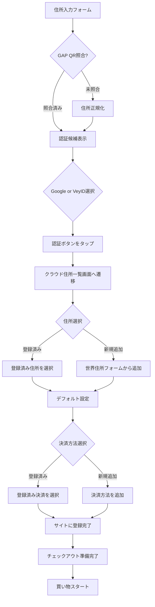

# 決済統合システム / Payment Integration System

住所＋決済ファーストのプロダクト仕様として、クラウド住所帳に決済方法を統合します。

## 📋 概要

クラウド住所帳システムに決済機能を追加し、以下を実現します：

- 🔐 **決済トークンの安全な保存**: カード番号ではなく決済ID/トークンを保存
- ⚡ **高速チェックアウト**: 住所＋決済が事前登録済みで即座に買い物開始
- 🌍 **EC間での再利用**: 一度登録すれば複数のECサイトで利用可能
- 🔑 **ユーザー主権**: ユーザーが決済情報を完全に管理

## 🎯 新機能の概要

### 1. 決済方法の事前登録

クラウド住所帳に以下の決済方法を事前登録できます：

- **カード決済**: Visa / Mastercard / American Express / JCB
- **デジタルウォレット**: PayPal / Stripe
- **モバイル決済**: Apple Pay / Google Pay
- **その他**: 銀行振込など

### 2. セキュリティ設計

- カード番号などの機密情報は**保存しない**
- 決済プロバイダー（Stripe、PayPal等）が発行する**トークン/IDのみ**を保存
- トークンはAES-256-GCMで暗号化して保存
- ユーザー署名による改ざん防止

### 3. ECサイトでの利用フロー

1. ユーザーがソーシャルログイン
2. クラウド住所帳から住所＋決済を選択
3. ECサイトに権限を付与
4. 即座にチェックアウト可能

## 🔄 ECサイトでのユーザー体験フロー

### パターン1: 住所＆決済ありユーザー（最速）

```
住所入力 → GAP照合 → ソーシャルログイン表示 
→ 住所/決済登録権限付与 → 買い物可能
```

**所要時間**: 約30秒

### パターン2: 住所なし決済ありユーザー

```
住所フォーム選択 → 新規保存 → ID作成 
→ デフォルト住所設定 → 決済ID連携 → 買い物可能
```

**所要時間**: 約1-2分

### パターン3: 住所/決済なしユーザー（新規）

```
世界住所フォーム選択 → 住所登録 
→ Google/VeyIDでサインアップ → デフォルト住所設定
→ 決済方法追加 → 買い物可能
```

**所要時間**: 約2-3分

## 📊 画面遷移仕様（強化版）

### ソーシャルログイン時の挙動



### フロー詳細

1. **住所入力**: ユーザーが住所を入力 or GAP QRで照合
2. **認証候補表示**: Google / Veyform ID を表示
3. **ログイン/サインアップ選択**: どちらかを選択
4. **住所一覧画面へ遷移**: クラウドにある住所一覧を表示
5. **住所選択**:
   - 登録済み住所を選択 → サイトに登録完了
   - デフォルト住所の設定も可能
   - 必要なら新規住所も世界すべての住所フォームから追加
6. **決済方法選択**:
   - 登録済み決済方法を選択 → サイトに登録完了
   - デフォルト決済方法の設定も可能
   - 必要なら新規決済方法を追加
7. **住所＋決済確定後**: Checkoutに進み買い物スタート

## ⚡ 高速チェックアウトUXの定義

### 技術/構造と高速化の理由

| 技術/構造 | 高速につながる理由 |
|-----------|-------------------|
| デフォルト住所の保存 | 次回から選択不要で即復元可能 |
| 事前決済トークンの保存 | カード番号をサイトに渡さず安全な決済IDだけ再利用 |
| 住所→PIDでユニーク識別 | ECごとで住所の表記順序が違っても識別結果は変わらない |
| ソーシャルログイン=買い物開始可能 | 余計なフォーム入力不要 |

### 「高速」の定義

以下の3点が同時に成立する状態を指します：

1. ✅ **住所照合済**（GAP/PID/正規化）
2. ✅ **認証済**（Google or VeyID）
3. ✅ **決済権限リンク済**（クラウド側にトークン保存）

## 🗄️ データベースモデル拡張

### 住所と決済の保存場所と責任

| データ | 保存場所 | EC提出時 | 削除権限 | 漏洩責任 |
|--------|---------|---------|---------|---------|
| 住所本体 | Cloud Address Book | PIDで引用 | ユーザーが削除可能 | EC側 |
| 決済方法 | Cloud Payment Token Store | 決済IDで引用 | ユーザーが削除可能 | EC側 |
| デフォルト住所 | 同ユーザーのクラウド設定 | ECで復元 | 編集可能 | EC側 |
| デフォルト決済 | 同ユーザーのクラウド設定 | ECで復元 | 編集可能 | EC側 |

### データモデル

`PaymentEntry` モデルの詳細は `docs/examples/cloud-address-book/database-schema.ts` を参照してください。

主要フィールド：

```typescript
interface PaymentEntry {
  id: string;                      // 内部ID
  user_did: string;                // ユーザーDID
  payment_token_id: string;        // 決済トークンID（一意）
  
  // 決済プロバイダー情報
  provider: string;                // Stripe, PayPal, etc.
  provider_customer_id: string;    // プロバイダー側の顧客ID
  
  // 暗号化された決済トークン
  encrypted_payment_token: string;
  encryption_algorithm: string;
  encryption_iv: string;
  
  // 表示用情報（機密でない）
  payment_type: string;            // card, paypal, apple_pay, etc.
  card_last4?: string;             // カード下4桁
  card_brand?: string;             // Visa, Mastercard, etc.
  
  // 状態管理
  is_revoked: boolean;
  is_default: boolean;
  is_verified: boolean;
  
  // タイムスタンプ
  created_at: string;
  updated_at: string;
  last_used_at?: string;
  expires_at?: string;
}
```

## 🔌 API エンドポイント

### 決済方法管理 API

#### POST /v1/payments - 新規決済方法登録

```typescript
{
  "provider": "stripe",
  "provider_customer_id": "cus_xxxxx",
  "payment_token": "tok_xxxxx",
  "payment_type": "card",
  "card_last4": "4242",
  "card_brand": "Visa",
  "card_exp_month": 12,
  "card_exp_year": 2025,
  "is_default": true,
  "label": "メインカード"
}
```

#### GET /v1/payments - 決済方法一覧取得

```typescript
{
  "payments": [
    {
      "id": "pay_xxxxx",
      "payment_token_id": "ptok_xxxxx",
      "payment_type": "card",
      "card_last4": "4242",
      "card_brand": "Visa",
      "is_default": true,
      "label": "メインカード"
    }
  ]
}
```

#### GET /v1/payments/{id} - 特定決済方法取得

#### PUT /v1/payments/{id} - 決済方法更新

#### DELETE /v1/payments/{id} - 決済方法削除（失効）

#### POST /v1/payments/{id}/verify - 決済方法検証

#### POST /v1/payments/nonce - ワンタイム決済Nonce生成

```typescript
{
  "payment_id": "pay_xxxxx",
  "amount": 10000,
  "currency": "JPY",
  "order_id": "order_12345"
}

// Response
{
  "nonce": "nonce_xxxxx",
  "expires_at": "2024-01-01T12:00:00Z"
}
```

## 🛒 ECサイト統合例

### Shopify 統合

```typescript
import { VeyformSDK } from '@vey/shopify';

// 初期化
const veyform = new VeyformSDK({
  apiKey: 'your-api-key',
  shopDomain: 'your-shop.myshopify.com'
});

// チェックアウトページに統合
async function handleCheckout() {
  // 1. ユーザー認証
  const user = await veyform.authenticate();
  
  // 2. 住所＋決済選択
  const { address, payment } = await veyform.selectAddressAndPayment({
    allowNewAddress: true,
    allowNewPayment: true
  });
  
  // 3. Shopifyチェックアウトに適用
  await shopify.checkout.update({
    shippingAddress: address.toShopifyFormat(),
    paymentToken: payment.getNonce()
  });
}
```

### WooCommerce 統合

```php
<?php
// WooCommerce Veyform Integration Plugin

add_action('woocommerce_before_checkout_form', 'veyform_checkout_button');

function veyform_checkout_button() {
    echo '<div id="veyform-checkout"></div>';
    echo '<script src="https://cdn.veyform.com/v1/checkout.js"></script>';
    echo '<script>
        Veyform.init({
            apiKey: "' . get_option('veyform_api_key') . '",
            onSuccess: function(data) {
                // 住所と決済をWooCommerceに設定
                jQuery.post("/wp-admin/admin-ajax.php", {
                    action: "veyform_apply_checkout",
                    address_pid: data.address.pid,
                    payment_token: data.payment.token
                });
            }
        });
    </script>';
}
```

### Next.js / React 統合

```tsx
import { VeyProvider, useVeyCheckout } from '@vey/react';

function CheckoutPage() {
  const { selectAddressAndPayment, isLoading } = useVeyCheckout();
  
  const handleVeyCheckout = async () => {
    try {
      const result = await selectAddressAndPayment({
        allowNewAddress: true,
        allowNewPayment: true,
        defaultToLastUsed: true
      });
      
      // 住所と決済をECカートに適用
      setShippingAddress(result.address);
      setPaymentMethod(result.payment);
      
      // チェックアウト続行
      proceedToPayment();
    } catch (error) {
      console.error('Veyform checkout failed:', error);
    }
  };
  
  return (
    <div>
      <button 
        onClick={handleVeyCheckout}
        disabled={isLoading}
      >
        Veyform で高速チェックアウト
      </button>
    </div>
  );
}

function App() {
  return (
    <VeyProvider apiKey="your-api-key">
      <CheckoutPage />
    </VeyProvider>
  );
}
```

## 🔐 セキュリティ機能

### 1. 決済トークンの暗号化

```typescript
// 決済トークンの暗号化
const encryptedToken = await encrypt({
  data: paymentToken,
  algorithm: 'AES-256-GCM',
  key: userKey,
  iv: randomIV()
});
```

### 2. ワンタイム Nonce 生成

```typescript
// 決済前にワンタイムトークン生成
const nonce = await generatePaymentNonce({
  paymentId: 'pay_xxxxx',
  amount: 10000,
  currency: 'JPY',
  expiresIn: 300 // 5分間有効
});

// ECサイトで使用
const charge = await stripe.charges.create({
  amount: 10000,
  currency: 'jpy',
  source: nonce, // ワンタイムトークン
  customer: customerId
});
```

### 3. 決済権限の取り下げ

```typescript
// ECサイトとの連携解除時
await revokePaymentAccess({
  ecSiteDid: 'did:web:ec-site.example',
  paymentId: 'pay_xxxxx'
});
```

## 🔄 Webhook 対応

### 住所更新通知 Webhook

```typescript
// ECサイトで登録
POST /v1/webhooks
{
  "url": "https://your-ec-site.com/webhooks/veyform",
  "events": ["address.updated", "payment.updated", "payment.revoked"]
}

// Webhook受信例
{
  "event": "address.updated",
  "user_did": "did:key:user123",
  "old_pid": "JP-13-113-01",
  "new_pid": "JP-13-113-02",
  "timestamp": "2024-01-01T12:00:00Z"
}
```

### 決済更新通知 Webhook

```typescript
{
  "event": "payment.updated",
  "user_did": "did:key:user123",
  "payment_id": "pay_xxxxx",
  "payment_type": "card",
  "card_last4": "4242",
  "card_exp_month": 12,
  "card_exp_year": 2026,
  "timestamp": "2024-01-01T12:00:00Z"
}
```

## 📱 UI構造テキスト

### 住所＋決済一覧画面

```
┌─────────────────────────────────────┐
│  Veyform クラウド住所帳              │
├─────────────────────────────────────┤
│  [タブ: 住所] [タブ: 決済方法]       │
├─────────────────────────────────────┤
│  📍 住所一覧                         │
│                                     │
│  ✓ 自宅 (デフォルト)                 │
│    東京都渋谷区道玄坂1-2-3           │
│    〒150-0043                        │
│    [選択] [編集]                     │
│                                     │
│  職場                                │
│    東京都港区六本木1-1-1             │
│    〒106-0032                        │
│    [選択] [編集]                     │
│                                     │
│  [+ 新しい住所を追加]                │
├─────────────────────────────────────┤
│  💳 決済方法一覧                     │
│                                     │
│  ✓ Visa ****4242 (デフォルト)       │
│    有効期限: 12/2025                 │
│    [選択] [編集]                     │
│                                     │
│  PayPal                             │
│    user@example.com                 │
│    [選択] [編集]                     │
│                                     │
│  [+ 新しい決済方法を追加]            │
├─────────────────────────────────────┤
│  [キャンセル] [ECサイトに登録して続行]│
└─────────────────────────────────────┘
```

### チェックアウト完了画面

```
┌─────────────────────────────────────┐
│  ✓ チェックアウト準備完了             │
├─────────────────────────────────────┤
│  配送先住所:                         │
│  📍 自宅                             │
│  東京都渋谷区道玄坂1-2-3             │
│  〒150-0043                          │
│  [変更]                              │
├─────────────────────────────────────┤
│  決済方法:                           │
│  💳 Visa ****4242                   │
│  有効期限: 12/2025                   │
│  [変更]                              │
├─────────────────────────────────────┤
│  [注文を確定する]                    │
└─────────────────────────────────────┘
```

## 🌍 多様なユースケース

### 1. ECショッピング
- 住所＋決済で高速チェックアウト
- 複数ECサイト間での再利用

### 2. ホテル予約
- チェックイン時の住所自動入力
- 決済情報の事前登録

### 3. 金融サービス
- 本人確認（KYC）での住所証明
- 口座開設時の決済設定

### 4. 引越しサービス
- 旧住所→新住所の自動更新
- 関連サービスへの一括通知

### 5. サブスクリプション
- 継続課金の決済方法管理
- 住所変更時の自動更新

## 📚 関連ドキュメント

- [クラウド住所帳システム概要](./cloud-address-book.md)
- [システムアーキテクチャ](./cloud-address-book-architecture.md)
- [データベーススキーマ](./examples/cloud-address-book/database-schema.ts)
- [API仕様](./zkp-api.md)
- [Webhook統合ガイド](./webhook-integration.md)

## 🎯 まとめ

Veyform クラウド住所帳システムに決済機能を統合することで：

1. ✅ **住所＋決済の一元管理** - 一度登録すれば複数のサービスで再利用
2. ✅ **高速チェックアウト** - 認証するだけで即座に買い物開始
3. ✅ **安全な決済** - カード番号を保存せずトークンのみを管理
4. ✅ **ユーザー主権** - ユーザーが自分のデータを完全にコントロール

これにより、ECサイトでの購買体験を劇的に向上させます。
